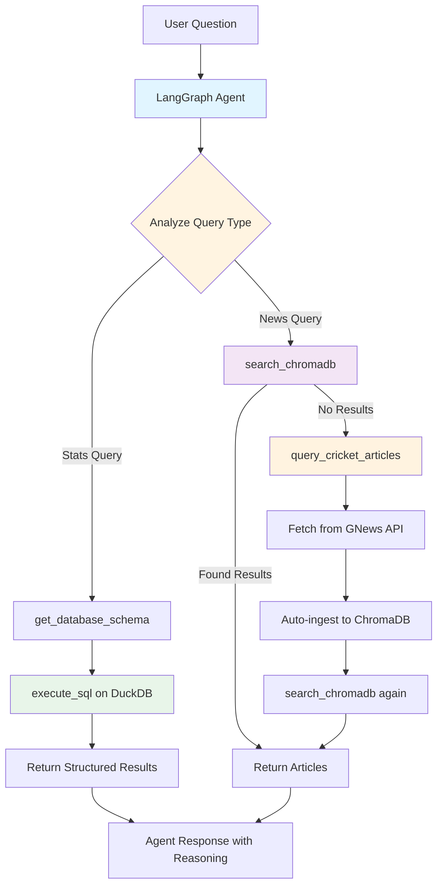

# Cricket Intelligence System

       

As an engineer, I wanted to understand **when to use what data stack**. Text-to-SQL? Vector DB? Knowledge Graphs (coming soon)?

Everyone talks about MCP (Model Context Protocol), but I needed to build something real to see how it works. The goal: create an intelligent agent that actually knows which approach to use for different query types, not just force everything through one paradigm.

**P.S.** I love Test cricket, so naturally I built this around cricket data. 🏏

## How It Works



The agent uses **MCP (Model Context Protocol)** tools - atomic functions that do one thing well. The LLM orchestrates which tools to call based on the query intent.

**Smart Fallback**: When searching for news that doesn't exist locally, the agent automatically fetches from GNews API, ingests to ChromaDB, and searches again. The system expands its knowledge base on-demand.

### Why MCP Tools?

The atomic design makes it trivial to add new capabilities. Want to add **Knowledge Graphs**?

1. Develop the tool → `kg_tools.py` with functions like `query_knowledge_graph()`
2. Register it → Add to the MCP toolbox in `mcp_client.py`
3. Update prompt → Tell the agent when to use KG
4. Done → Agent automatically routes queries to the right stack

No refactoring. No breaking changes. Just add the new tool and let the LLM figure out when to use it.

This is how I'll be adding Knowledge Graph support next - the architecture makes experimentation easy.

## Quick Start

```bash
# Install
pip install -e .

# Setup environment
cp .env.example .env
# Add your OPENAI_API and GNEWS_API_KEY to .env

# Run (see notebooks/test_agent.ipynb)
from cricket_intelligence import CricketAgent

agent = CricketAgent()
response = await agent.ask("Who scored the most runs in 2024?")
```

## Example Interactions

### Stats Query → Text-to-SQL
```
Q: "Who are the top 5 run scorers in Test cricket history?"

Agent Reasoning:
→ This is a statistical query requiring aggregation
→ Using execute_sql on DuckDB

SQL Generated:
SELECT p.name, SUM(b.runs_scored) as total_runs
FROM batting b
JOIN players p ON b.player_id = p.player_id
GROUP BY p.name
ORDER BY total_runs DESC
LIMIT 5

Results:
1. Sachin Tendulkar - 15,921 runs
2. Ricky Ponting - 13,378 runs
...
```

### News Query → Vector Search
```
Q: "What's happening with the Indian cricket team?"

Agent Reasoning:
→ Semantic search for recent news
→ Using search_chromadb for vector similarity

Results:
📰 "India wins series 3-1 against Australia"
📰 "Rohit Sharma's captaincy praised by experts"
...
```

### Smart Fallback in Action
```
Q: "Tell me about Zimbabwe cricket"

Agent Reasoning:
→ Searching ChromaDB... no results found
→ Triggering fallback: fetching from GNews API...
→ Ingested 8 new articles to ChromaDB
→ Searching again... found 8 articles

Results:
📰 "Zimbabwe upsets Pakistan in T20 series"
...
```

## Project Structure

```
cricket-intelligence-system/
├── src/cricket_intelligence/
│   ├── agent/                  # LangGraph agent orchestration
│   │   ├── cricket_agent.py   # Main agent
│   │   └── mcp_client.py      # MCP tool integration
│   ├── api/tools/              # MCP tools (atomic functions)
│   │   ├── stats_tools.py     # Text-to-SQL tools
│   │   └── news_tools.py      # Vector search + GNews
│   ├── core/                   # Shared utilities
│   │   ├── embeddings.py      # Sentence transformers
│   │   ├── chromadb.py        # Vector DB operations
│   │   └── news_client.py     # GNews API client
│   ├── pipelines/              # ETL (Bronze → Silver)
│   │   ├── stats/             # Cricket stats transformation
│   │   └── news/              # News ingestion
│   └── config.py              # Centralized settings
└── tests/                      # unit/integration/e2e
```

## Data Sources

**Cricket Stats** (Kaggle Test cricket dataset, 1877-2024)
- Bronze: Raw CSVs preserved as-is
- Silver: 6 normalized tables (players, matches, batting, bowling, partnerships, fall_of_wickets)
- Storage: DuckDB for OLAP analytics

**Cricket News** (GNews API)
- Live cricket news fetched on-demand
- Embedded with all-MiniLM-L6-v2 (384-dim)
- Storage: ChromaDB with metadata (title, URL, date)

---

**Experimenting with Text-to-SQL, Vector Search, and (soon) Knowledge Graphs to understand when to use which approach.**
